# Lecture 01: 快速实现一门简单的编程语言

## 简介

本文是 XJTU PLDI Group 小组的第一次知识分享活动的讲义。

本文主要面向有一定编程经验的初学者，所以一些定义可能不是很规范，请见谅。

### 内容概述

我们该如何以最简单的方式实现一门编程语言？可以分为以下三步：

1. 设计语法：描述这门编程语言大概长什么样
2. 写解析器：把一串文字转换为可以处理的数据结构
3. 写解释器：直接执行解析器输出的数据结构

一般来说，这样可以最快地实现编程语言的运行功能。

本文共分 7 小节：

- 前 3 小节是 分别讲解这 3 步的理论
- 后 3 小节是 分别讲解这 3 步的具体代码实现
- 最后是留给读者的一些挑战

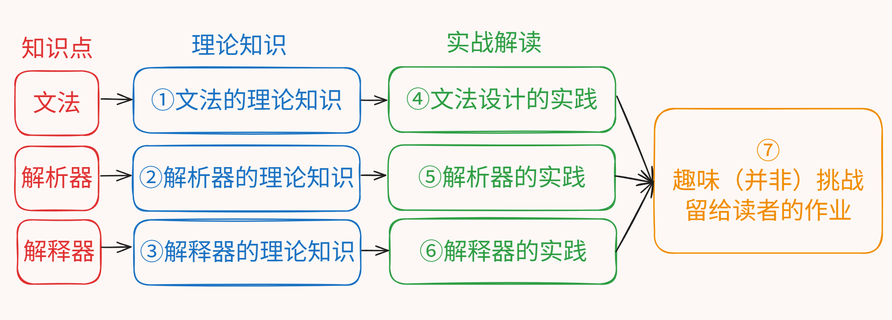

### 成果展示

我们将实现一个有基础运算、条件判断、循环、函数调用等语言特性的简单语言。

这个实验语言没有添加太多语言特性，有利于初学者快速了解编程语言的实现模式。

```javascript
function main() {
    res = foo(10, 20);
    flag = bar(res);
    if (!flag) {
        while (1) noArg();
    }
    v = (g1 + g2) * (res - 1) / 2;
    print(v);
    return 1;
}
```

---

## 1. 根据语言特性，描述语言的语法

编程语言的代码，本质上来说就是一段有特定格式的文字。设计编程语言的语法，就是规定执行某种操作的代码应该用什么格式写。
比如给变量赋值就要以 `变量 = 值` 等格式写，定义函数也有 `function 函数名() { 代码 }` 这样的特定格式。

我们要设计一门完善的编程语言，就要给计算机上的各种操作都设计一些语法来对应，使我们的编程语言的代码可以描述各种各样的计算机程序。

比如我们的语言要支持加法运算，就要选择一种语法表示它：

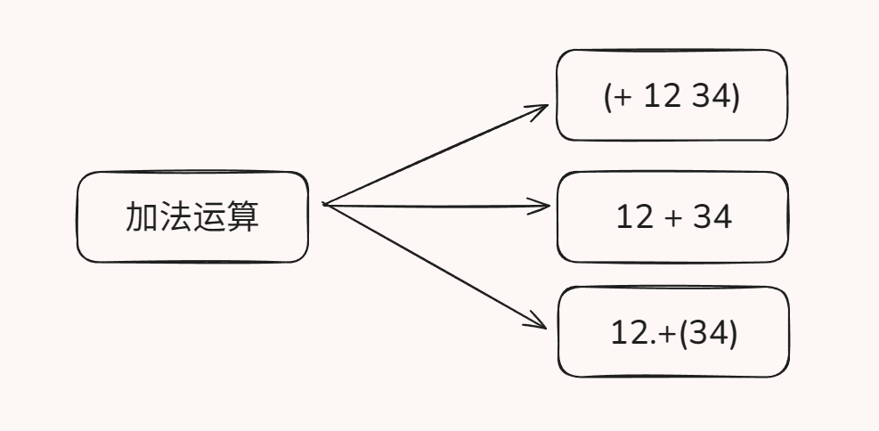

确定了编程语言使用什么样的语法之后，我们就知道如何解析用这种编程语言编写的源代码文本，可以开始实现我们的编程语言。

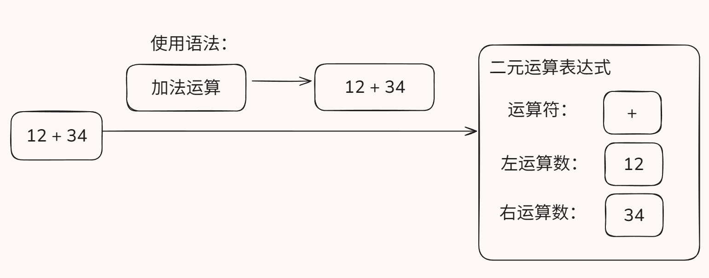

### 1.1 文法：规范地描述编程语言的语法

我们把编程语言的各种语法规则称为 **“文法”**。

为了使文法清晰无歧义，我们通常用一些特定的记号来形式化地描述文法，而不是简单地用自然语言描述。

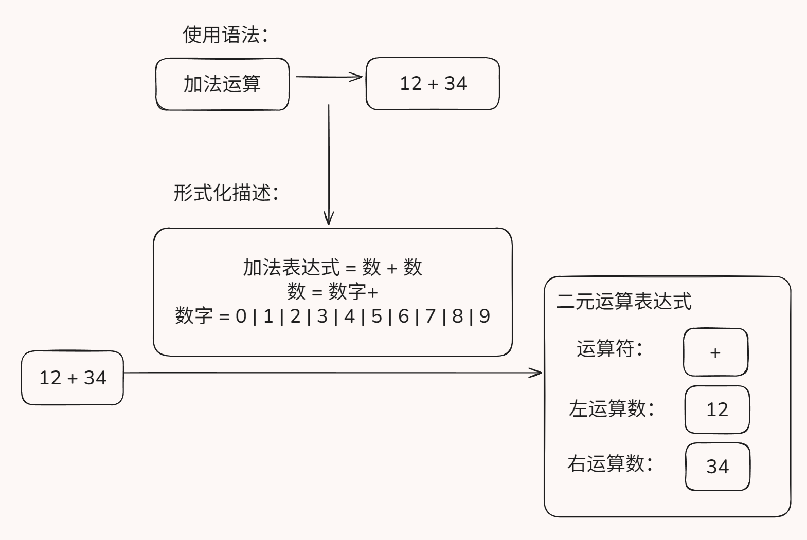

在本文和以后的文章中，我们使用一些简单的规则来描述文法，请参考示例。每行被称为一个 **产生式**，左边是产生的结构，右边是组成结构的组件，表示的含义是有右边的组件，就能组成一个左边的结构：

```plaintext
普通的字符串序列   : '一串普通的字符'

A                  : 'a'
一个或多个 A       : A+
没有或一个 A       : A?
没有或者有任意个 A : A*
不是A的            : ~A

B                  : 'b'
A 和 B 连续出现    : A B
A 和 B 之一        : A | B
括号括成一组       : (A B)
AB 或者 BA         : (A B) | (B A)
```

用这样的记号，我们就能描述字符串遵从某种特定模式，以此来描述编程语言的语法，比如用下列规则：

```plaintext
数字   = '0' | '1' | '2' | ... | '9'
运算符 = '+' | '-'
数     = 数字+
算式   = 数 运算符 数
```

就可以匹配 `4 + 5` 这样的字符串是一个算式，由数 `4`，运算符 `+` 和数 `5` 组成。

### 1.2 文法的分类：词法，语法

在实际的工程中，我们会发现，直接从一个个字符直接解析到复杂的语法结构是比较困难的。
为了减小代码实现的复杂度，我们通常把从字符串解析代码结构的工作分为两个阶段，分别叫 **词法分析** 和 **语法分析**。
相对应地，文法也分为两个部分：**词法** 和 **语法**。

一般来说，直接从源代码字符串得到单词的的文法被归类为 **词法**，其解析出的单词被称为 **词元 (Token)**。
而用于将一系列词元组合成复杂的语法结构（如函数定义、算术表达式等）的文法被归类为 **语法**。

也就是说，词法的产生的结构，即词元，没有子结构，都是由字符组成。而语法产生的结构可能互相嵌套，比如一个 if 语句 有 条件、条件为 true 时执行的语句、条件为 false 时执行的语句 等子结构。

用自然语言打比方的话，词法就是把字组合成词的规则，而语法是把词一步步向上组合成词组、句子、段落、文章的规则。

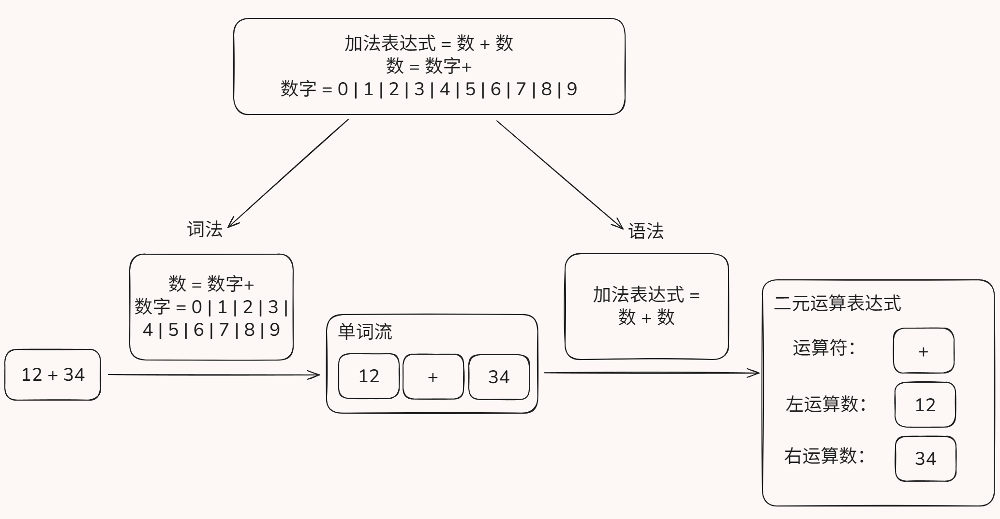

例如上面的文法就可以分类：

```plaintext
> 词法
数字   = '0' | '1' | '2' | ... | '9'
运算符 = '+' | '-'
数     = 数字+

> 语法
算式   = 数 运算符 数
```

---

## 2. 根据语言文法，编写源代码解析器

上面提到，在实际的工程中，我们进行两阶段的解析。

### 2.1 词法分析 (Tokenization / Lexical Analysis)

按照词法规则，即可编写出 **词法分析器（Tokenizer / Lexer）**，把源代码字符串分割成一系列词元。我们通常在词元上标注它的类型和文本内容。

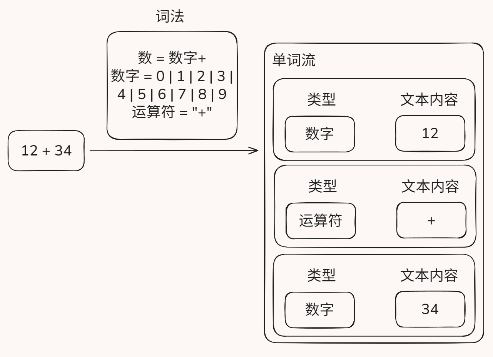

词法分析器的实现较为简单，一般使用一个状态机，从前到后线性地扫描一遍源代码，就可以把所有的词元提取出来。

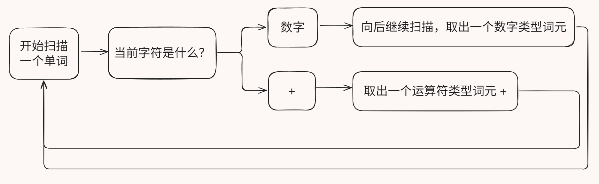

### 2.2. 语法分析 (Parsing / Syntax Analysis)

#### 2.2.1 建模抽象语法树

我们注意到，编程语言中的结构有层次性（比如一个文件可以包含多个函数，一个函数可以包含多个局部变量），而且在文本上互不重叠。所以，将源代码解析后，我们使用树形的数据结构来存储数据，每个语法结构都是这种树形结构上的一个节点，结构之间通过父子关系来表示隶属关系。

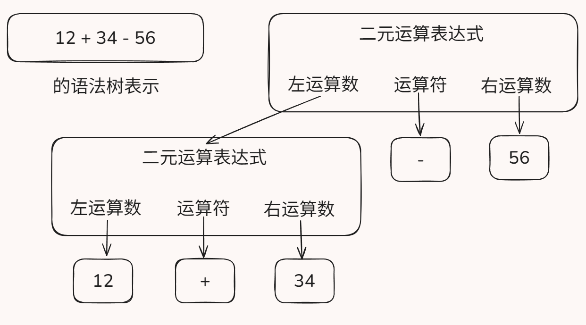

我们可以为每条语法指定一个结构来保存其数据，同时不用为词法指定新的节点，可以直接用原来表示词元用的结构。

我们把这种用于存储结构化、层次化的代码信息的数据结构称为 **抽象语法树 (Abstract Syntax Tree, AST)**。

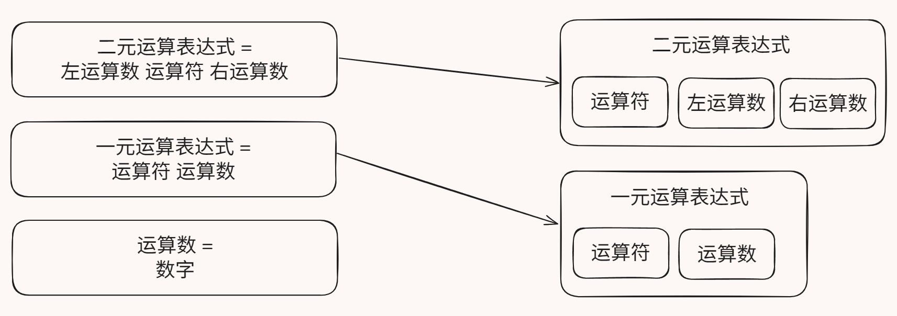

#### 2.2.2 使用递归下降模式编写语法分析器

完成了对数据的建模，接下来需要编写一个 **语法分析器 (Syntax Analyzer / Parser)** 来将词法分析器输出的词元组织成语法树表示。

我们采取一种称为 **递归下降 (Recursive-Descent)** 的模式来编写语法分析器。与语法树节点类似，我们也是为每条语法编写一个函数来处理。

递归下降的意思就是：处理高层次语法的函数会调用处理低层次语法的函数来处理，然后将其处理结果，也就是低层次的语法树节点，组织成高层次的语法树节点。

在递归下降的模式中，一个处理函数只处理一个语法。处理高层次语法的函数将处理自己的元素的任务交给处理低层次语法的函数，一步步向下，最下方需要处理的是没有子结构的词元，不用再次向下调用。然后各级函数能依次返回，构建出完整的语法树。

你可以参考下面的猫来感悟递归下降的奥义。每个猫都调用了下层的猫，直到最下层的猫，然后大家的猫爪会依次返回。


例如有下列文法：

```plaintext
> 语法
条件判断: 'if' 条件 语句
条件: 真 | 假
语句: ......

> 词法
真: 'true'
假: 'false'
```

则我们会这样编写语法分析器：

```python
函数 解析条件判断():
    匹配词元('if')
    条件 = 解析条件()
    语句 = 解析语句()
    返回 语法树节点('条件判断', 条件, 语句)

函数 解析条件():
    如果 当前词元是('true'):
        匹配词元('true')
        返回 语法树节点('真')
    或者如果 当前词元是('false'):
        匹配词元('false')
        返回 语法树节点('假')

......
```

---

## 3. 根据语法树结构，编写语法树解释器

完成了语法分析，获得了语法树，我们就知道程序的精确结构了，我们可以通过想办法直接执行语法树来实现程序的功能，这样，我们就成功实现了一门简单的编程语言。

不幸地，现在的 CPU 并不能执行我们的语法树节点。不过，我们可以编写一个 **解释器 (Interpreter)** 来 **解释执行** 这些语法树节点。
具体来说，我们首先需要找出每种语法树节点对应的执行逻辑，然后在处理该语法树节点的时候，手动执行对应的操作。

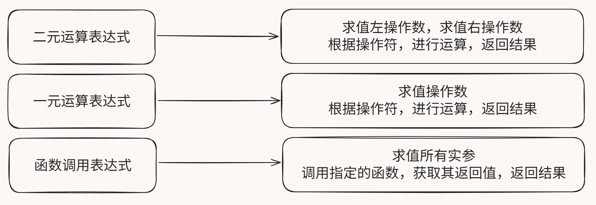

与前面的工作类似，搞清楚了每种语法树节点对应的执行逻辑后，我们同样可以通过为每种语法树节点编写一个解释函数的方式，实现整个解释器。例如有语法：

```plaintext
> 语法
条件判断: 'if' 条件 语句
条件: 真 | 假
语句: ......

> 词法
真: 'true'
假: 'false'
```

则可以有解释器

```python
函数 解释执行(语法树节点):
    如果 节点类型是('条件判断'):
        如果 解释执行(节点.条件) 得到的值是 真:
            解释执行(节点.真分支)
        否则:
            解释执行(节点.假分支)

...
```

---

## 后文需要的参考资料

由于下面的 3 个小节讲解实践性的内容，建议大家结合示例代码阅读。

大家可以在该地址中找到我们需要实现的语言的形式化文法：
<https://gitcode.com/MikanAffine/lectures-and-code/blob/main/lec1/lab/example/grammar.txt>

在同一个目录下里还有一份可供参考的示例代码实现：
<https://gitcode.com/MikanAffine/lectures-and-code/tree/main/lec1/lab/example/>

另外，这些代码，以及后文的代码，都是用 Python 语言编写的。如果你对 Python 不熟悉，可以复制到大语言模型里面问是什么意思。

---

## 4. 实战: 设计一份文法

回顾我们之前的设计：

> 我们将实现一个有基础运算、条件判断、循环、函数调用等语言特性的简单语言。
>
> ```javascript
> function main() {
>     res = foo(10, 20);
>     flag = bar(res);
>     if (!flag) {
>         while (1) noArg();
>     }
>     v = (g1 + g2) * (res - 1) / 2;
>     print(v);
>     return 1;
> }
> ```

我们应该恰当地设计文法，使得每个语言特性都能通过语言文法呈现出来。

例如基础运算：假设我们要为编程语言添加算术运算、比较运算这几种运算。那么，我们应该要添加 `+ - * / == != > < >= <= !` 这些运算符到词法里，这样可以将它们识别成词元。那么，我们可以这么写：

```plaintext
运算符 = '+' | '-' | '*' | '/' | '=='
    | '!=' | '<=' | '<' | '>=' | '>' | '!'
```

然后，我们再观察运算表达式的结构，发现这些运算符对应的算式都有一个或两个运算数，而这些运算数又可以是普通的数字、变量的值或者另外的表达式，那么，我们可以这么写：

```plaintext
// 先修改词法，分类一下运算符
二元运算符 = '+' | '-' | '*' | '/' | '=='
    | '!=' | '<=' | '<' | '>=' | '>'
一元运算符 = '+' | '-' | '!'

// 然后写语法
表达式 = 二元运算表达式 | 一元运算表达式 | 变量 | 数字常量
二元运算表达式 = 表达式 二元运算符 表达式
一元运算表达式 = 一元运算符 表达式
调用表达式 = 函数名 '(' (表达式 (',' 表达式)*)? ')'
变量: 名字
数字常量: 数
```

再比如条件判断 if 语句：我们想把它设计为 `if (条件) 语句`，后面可以跟一个可选的 `else 语句`，我们可以这么写：

```plaintext
语句 = ... | if语句
if语句 = 'if' '(' 表达式 ')' 语句 ('else' 语句)?
```

最终，我们可以把 `基础运算、条件判断、循环、函数调用` 这些我们需要的特性都通过文法表示出来。你也可以仿照上述案例，尝试撰写一份该语言的文法。参考答案在这里：
<https://gitcode.com/MikanAffine/lectures-and-code/blob/main/lec1/lab/example/grammar.txt>

---

## 5. 实战: 编写词法和语法分析器

### 词法分析

词法分析的实现相对简单。照着我们在上面讲的方法，从头到尾扫描一遍源代码即可切分出所有词元。

```python
源代码 = "某些奇妙的源代码"
位置 = 0
词元列表 = []

def 还有字符(): return 位置 < len(源代码)
def 前进一格(): 位置 += 1
def 词元(类型, 其他数据 = ""): pass

while 还有字符():
    当前字符 = 源代码[位置]

    if 当前字符 == '+':
        词元列表.append(词元('-'))
        前进一格()
    ...
    elif 当前字符.isdigit(): # 这个词元是数，直接把它全部扫描出来
        该数的开始位置 = 位置
        while 还有字符() and 源代码[位置].isdigit():
            前进一格()
        词元列表.append(词元('数', 源代码[该数的开始位置:位置]))
...
```

详细代码可查询
<https://gitcode.com/MikanAffine/lectures-and-code/blob/main/lec1/lab/example/tokenizer.py>

### 语法分析

语法分析的实现也不困难。照着我们在上面讲的方法...吗？

我们在实现具体的语法分析器时，似乎还需要解决两个问题。

#### Look Ahead

当我们看到这条文法：`表达式 = 数字常量 | 变量 | ...` 时，我们了解到，表达式是由数字常量，或者变量，或者其他的子结构组成的结构。我们打算用递归下降模式编写解析函数。

可是，我们应该如何调用下层函数？假设我们只调用 `匹配数字常量()`，那变量的情况就无法解析；假设我们只调用 `匹配变量()`，那数字常量的情况就无法解析；假设我们都调用，那我们解析的就是 `表达式 = 数字常量 变量` 了，与原义不符。

此时，我们需要向前看一个词元来消除匹配上的歧义。注意，我们只向前看，但不消费掉这个词元，否则又会出错。

```python
词元列表 = [ ... ]
位置 = 0

def 匹配表达式():
    if 向前看一个词元().类型 == '数字常量':
        # 不要 位置 += 1，不消费这个词元
        匹配数字常量()
    elif 向前看一个词元().类型 == '变量':
        匹配变量()
```

#### 左递归，消除左递归

我们还注意到，递归下降模式中，我们要匹配一个结构，首先要调用匹配子结构的函数。如果一个语法的定义中，最左边的组件是它自己，比如： `表达式 = 表达式 '+' 表达式`，那么我们在写 `匹配表达式()` 时，要先调用 `匹配表达式()` 自己，就无限递归了！

为了解决这个问题，我们需要消除左递归。

我们注意到，左递归的文法都呈 `A = A B | C` 的模式（不可能是 `A = A B` 这样单独出现，否则一定会无限递归，是无意义的）。
我们可以将最左边的元素改为可以单独产生该结构的子结构，后接零个到多个实际发生递归的项，来消除左递归，即 `A = A B | C -> A = C B*`  。

比如 `表达式 = 表达式 '+' 表达式 | 数字常量`，可以改为 `表达式 = 数字常量 ('+' 表达式)*` 。
这两条文法是等效的，但消除左递归后的文法，可以直接照着写出不会无限递归的递归下降解析器。

在示例文法中采用了类似 `表达式 = 数字常量 ('+' 表达式)?` 的写法，主要是因为递归项包含了自己，所以用 * 和用 ? 在匹配效果上没有区别。

#### 编写语法分析器

解决完这两个问题，我们就可以按照递归下降模式愉快地编写语法分析器了。

例如对于文法 `if语句 = 'if' '(' 条件 ')' 语句 ('else' 语句)?`，我们就可以先创建对应的语法树节点，然后编写处理函数：

```python
class if语句(语法树节点):
    def __init__(self, 条件, 真分支, 假分支=None):
        self.条件 = 条件
        self.真分支 = 真分支
        self.假分支 = 假分支

def 匹配if语句():
    匹配词元('if')
    匹配词元('(')
    条件 = 匹配表达式()
    匹配词元(')')
    真分支 = 匹配语句()
    if 向前看一个词元().类型 == 'else':
        匹配词元('else')
        假分支 = 匹配语句()
        return if语句(条件, 真分支, 假分支)
    else:
        return if语句(条件, 真分支)
```

详细代码可查询
<https://gitcode.com/MikanAffine/lectures-and-code/blob/main/lec1/lab/example/parser.py>

---

## 6. 实战: 编写语法树解释器

同样地，我们根据上面给出的理论进行语法树解释器的编写。对于 `基础运算、条件判断、循环、函数调用` 四个我们需要的主要特性，我们给相应的语法树节点编写处理函数，模拟其执行逻辑。

在实现这些特性时，我们可能会碰到一些困难，在文章中，我们举出几个常见的例子并解决它们。

### 基本运算

这是比较简单的，只需要求值操作数，然后根据运算符进行计算。

```python
def 表达式求值(语法树节点):
    if 语法树节点 is 二元运算语法树节点:
        return 处理二元运算(语法树节点)
    elif 语法树节点 is 一元运算语法树节点:
        return 处理一元运算(语法树节点)
    elif 语法树节点 is 变量语法树节点:
        return 获取变量的值(语法树节点.变量名)
    elif 语法树节点 is 数字常量语法树节点:
        return 语法树节点.数字常量值

def 处理二元运算(语法树节点):
    左操作数 = 表达式求值(语法树节点.左操作数)
    右操作数 = 表达式求值(语法树节点.右操作数)
    运算符 = 语法树节点.运算符
    if 运算符 == '+':
        return 左操作数 + 右操作数
    elif 运算符 == '-':
        return 左操作数 - 右操作数
    ...

def 处理一元运算(语法树节点):
    操作数 = 表达式求值(语法树节点.操作数)
    运算符 = 语法树节点.运算符
    if 运算符 == '!':
        return not 操作数
    elif 运算符 == '-':
        return -操作数
    elif 运算符 == '+':
        return 操作数
```

### 函数调用与返回

我们首先注意到，函数内部的局部变量是独立的，函数之间不会互相影响对方的局部变量，所以每次函数的调用都要有独立的局部变量表。

另外在调用别的函数时，要保存当前函数的局部变量表，然后再创建新的局部变量表，等被调用的函数返回后，再恢复回来。

```python
def 处理函数调用(函数的语法树节点, 实参列表):
    global 保存的状态, 局部变量表
    保存的状态.append(局部变量表)
    局部变量表 = {}

    形参列表 = 函数的语法树节点.形参列表
    for i in range(len(参数列表)):
        局部变量表[形参列表[i]] = 实参列表[i]
    ...
    局部变量表 = 保存的状态.pop()
    ...
```

另外，关于函数的返回语句如何处理？是在 `处理函数调用()` 中特判将要执行的语句是 return，然后直接处理吗？但我们注意到，return 语句可以嵌套在别的各种结构中，`处理函数调用()` 这里不一定能直接处理 return 语句。假如有：

```javascript
function a() {
    while(b()) {
        if (c) return d;
    }
}
```

那就无法在最上层直接特判将要执行的语句。

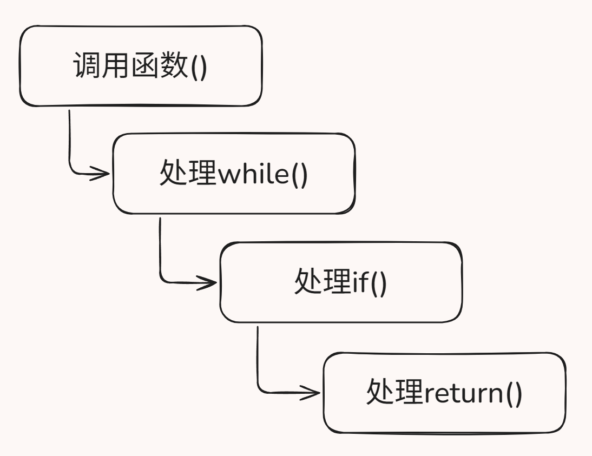

我们注意到，return 语句执行的时候要有两个效果：一是立即结束当前函数调用，二是可能会有一个返回值。那么，我们可以借助 python 的异常处理，在 `处理return语句()` 中用抛出异常来跳出多层函数调用，直接返回到最上层的 `处理函数调用()` ：

```python
class ReturnException(Exception): pass

def 处理函数调用(函数的语法树节点, 实参列表):
    ...
    try:
        处理语句块(函数的语法树节点.语句块)
    except ReturnException:
        pass
    ...

def 处理return语句(语法树节点):
    ...
    raise ReturnException()
```

同样地，由于 `处理return语句()` 的调用者不一定是 `处理函数调用()`，在传递返回值时，我们也不能直接让 `处理return语句()` 返回一个值，而是要把这个返回值保存在一个地方，让 `处理函数调用()` 在处理函数返回的时候把返回值取出来。我们可以借用局部变量表，用一个一定不会被用到的变量来存储返回值，比如 `return-value`，就是正常程序中声明不出来的变量：

```python
def 处理函数调用(函数的语法树节点, 实参列表):
    ...
    返回值 = 局部变量表['return-value']
    return 返回值

def 处理return语句(语法树节点):
    返回值 = 表达式求值(语法树节点.返回的表达式)
    局部变量表['return-value'] = 返回值
    ...
```

这样，我们就解决了处理函数调用中出现的一些困难。

### 循环与 break, continue

与 `return` 类似，`break` 与 `continue` 不能在 `处理while循环()` 里直接特判处理。我们同样通过异常来实现它们：

```python
class BreakException(Exception): pass
class ContinueException(Exception): pass

def 处理while循环(语法树节点):
    while 表达式求值(语法树节点.条件) == 真:
        try:
            处理语句块(语法树节点.语句块)
        except BreakException:
            break
        except ContinueException:
            continue

def 处理break语句(语法树节点):
    raise BreakException()

def 处理continue语句(语法树节点):
    raise ContinueException()
```

### 整个程序的开始与结束

别忘了，在刚进入解释器的时候，我们需要初始化全局环境（函数列表、全局变量）。
另外，我们还需要手动调用 `main()` 函数，并将其返回值作为整个程序的返回值。

```python
...
def 解释执行(语法树根节点):
    ...
    函数列表 = {}
    for 函数 in 语法树根节点.函数列表:
        函数列表[函数.名称] = 函数

    全局变量表 = {}
    for 全局变量赋值 in 语法树根节点.全局变量表:
        全局变量表[全局变量赋值.名称] = 表达式求值(全局变量赋值.值)

    main函数 = 查找函数('main')
    返回 处理函数调用(main函数, [])
```

---

## 7. 趣味（并非）挑战

你可能注意到，示例代码放在 `lab/example/` 下，而同一根目录下还有 `lab/todo/`，这就是我们准备的小 lab。

<https://gitcode.com/MikanAffine/lectures-and-code/tree/main/lec1/lab/todo/>

我们准备了 `for.slang` 和 `builtin.slang` 两个文件，你要尝试修改 `todo/` 中的代码，使得解释器能运行它们，即：

1. 仿照 while，添加 for 循环的语法实现
2. 仿照 print，支持更多内置函数，比如 sin、cos、tan、abs

在示例代码仓库中有一份 `grader.py` 可以进行功能评测。

加油！

---

**MikanAffine 敬上。**
