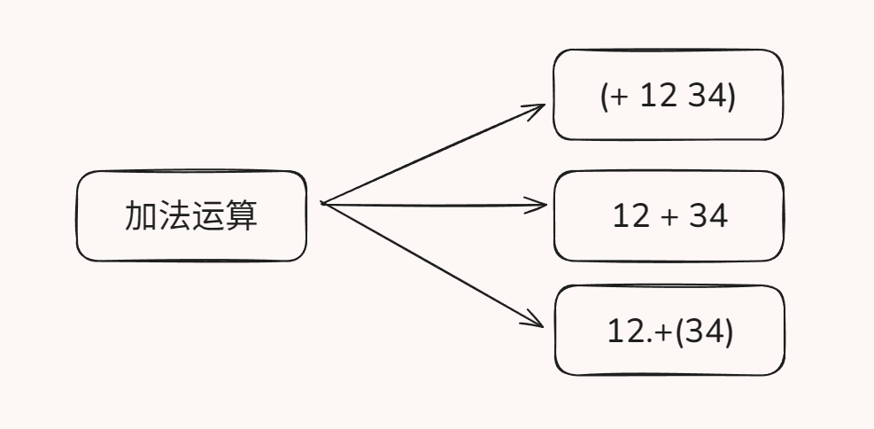
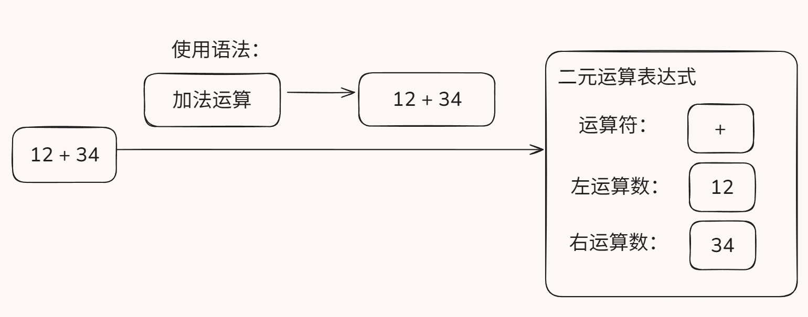
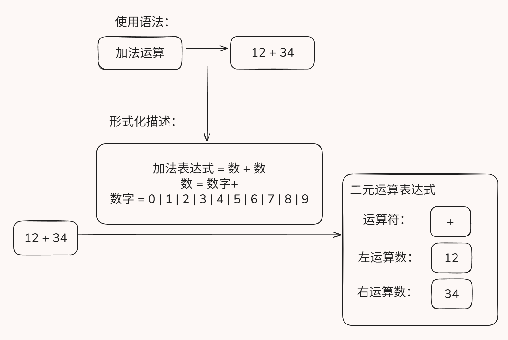
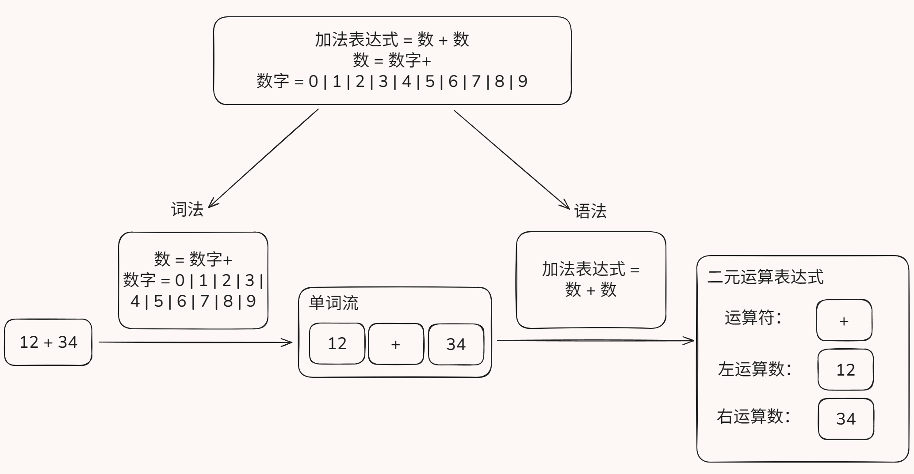
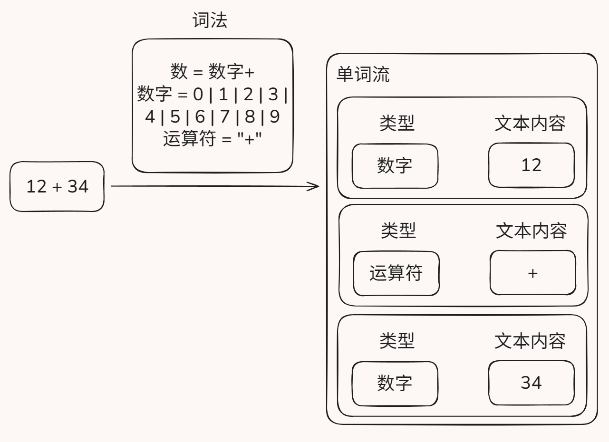
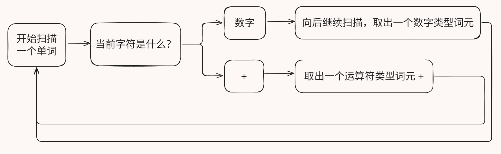
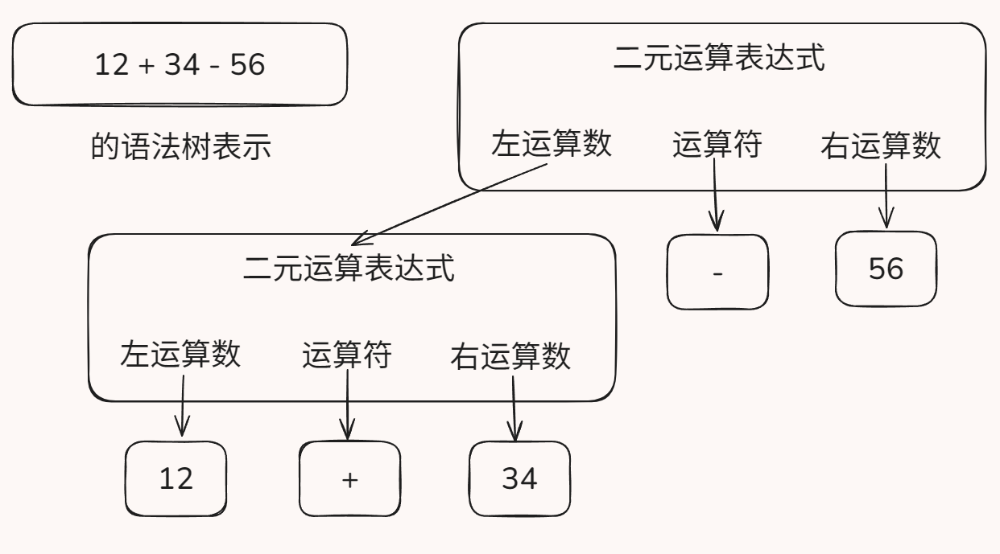
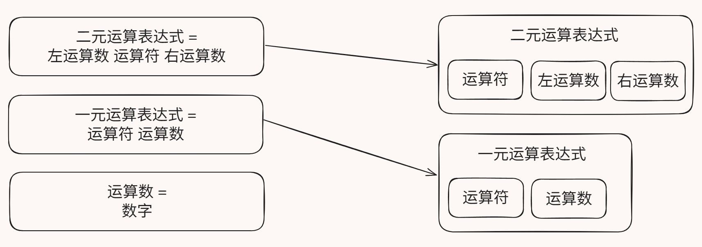
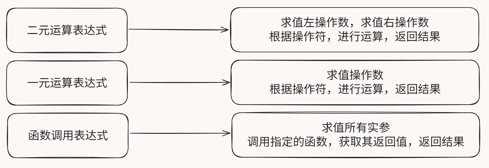

# SimpleLang: 在 2 小时内实现一门简单的编程语言

---

## 0. 简介

### 内容概述

我们该如何以最简单的方式实现一门编程语言？可以分为以下三步：

1. 设计语法：描述这门编程语言大概长什么样
2. 写解析器：把一串文字转换为可以处理的数据结构
3. 写解释器：直接执行解析器输出的数据结构

这样可以最快地实现编程语言的运行功能。

### 成果展示

我们将实现一个有基础运算、条件判断、循环、函数调用等语言特性的简单语言。

这个实验语言没有添加太多语言特性，有利于初学者快速了解编程语言的实现模式。

```javascript
function main() {
    res = foo(10, 20);
    flag = bar(res);
    if (!flag) {
        while (1) noArg();
    }
    v = (g1 + g2) * (res - 1) / 2;
    print(v);
    return 1;
}
```

---

## 1. 根据语言特性，设计语言的语法

编程语言的代码，本质上来说就是一段有特定格式的文字。设计编程语言的语法，就是规定执行某种操作的代码应该用什么格式写。
比如给变量赋值就要以 `变量 = 值` 等格式写，定义函数也有 `function 函数名() { 代码 }` 这样的特定格式。

我们要设计一门完善的编程语言，就要给计算机上的各种操作都设计一些语法来对应，使我们的编程语言的代码可以描述各种各样的计算机程序。



确定了编程语言使用什么样的语法之后，我们就知道如何解析用这种编程语言编写的源代码文本，可以开始实现我们的编程语言。



### 1.1 文法：规范地描述编程语言的语法

我们把编程语言的各种语法规则称为 **“文法”**。

为了使文法清晰无歧义，我们通常用一些特定的记号来形式化地描述文法，而不是简单地用自然语言描述。



在本文和以后的文章中，我们使用一些简单的规则来描述文法，请参考示例。每行被称为一个 **产生式**，左边是产生的结构，右边是组成结构的组件，表示的含义是有右边的组件，就能组成一个左边的结构：

```plaintext
A                  : 'a'
一个或多个 A       : A+
没有或一个 A       : A?
没有或者有任意个 A : A*

B                  : 'b'
A 和 B 连续出现    : A B
A 和 B 之一        : A | B
括号括成一组       : (A B)
AB 或者 BA         : (A B) | (B A)
```

用这样的记号，我们就能描述字符串遵从某种特定模式，以此来描述编程语言的语法，比如用下列规则：

```plaintext
数字   : '0' | '1' | '2' | '3' | '4' | '5' | '6' | '7' | '8' | '9'
运算符 : '+' | '-'
数     : 数字+
算式   : 数 运算符 数
```

就可以匹配 `4 + 5` 这样的字符串是一个算式，由数 `4`，运算符 `+` 和数 `5` 组成。

### 1.2 文法的分类：词法，语法

在实际的工程中，我们会发现，直接从一个个字符直接解析到复杂的语法结构是比较困难的。
为了减小代码实现的复杂度，我们通常把从字符串解析代码结构的工作分为两个阶段，分别叫 **词法分析** 和 **语法分析**。
相对应地，文法也分为两个部分：**词法** 和 **语法**。

一般来说，直接从源代码字符串得到单词的的文法被归类为 **词法**，其解析出的单词被称为 **词元 (Token)**。
而用于将一系列词元组合成复杂的语法结构（如函数定义、算术表达式等）的文法被归类为 **语法**。

也就是说，词法的产生的结构，即词元，没有子结构，都是由字符组成。而语法产生的结构可能互相嵌套，比如一个 if 语句 有 条件、条件为 true 时执行的语句、条件为 false 时执行的语句 等子结构。

用自然语言打比方的话，词法就是把字组合成词的规则，而语法是把词一步步向上组合成词组、句子、段落、文章的规则。



例如上面的文法就可以分类：

```plaintext
> 词法
数字   : '0' | '1' | '2' | '3' | '4' | '5' | '6' | '7' | '8' | '9'
运算符 : '+' | '-'
数     : 数字+

> 语法
算式   : 数 运算符 数
```

---

## 2. 根据语言文法，编写源代码解析器

上面提到，在实际的工程中，我们进行两阶段的解析。

### 2.1 词法分析 (Tokenization / Lexical Analysis)

按照词法规则，即可编写出 **词法分析器（Tokenizer / Lexer）**，把源代码字符串分割成一系列词元。我们通常在词元上标注它的类型和文本内容。



词法分析器的实现较为简单，一般使用一个状态机，从前到后线性地扫描一遍源代码，就可以把所有的词元提取出来。



### 2.2. 语法分析 (Parsing / Syntax Analysis)

#### 2.2.1 建模抽象语法树

我们注意到，编程语言中的结构有层次性（比如一个文件可以包含多个函数，一个函数可以包含多个局部变量），而且在文本上互不重叠。所以，将源代码解析后，我们使用树形的数据结构来存储数据，每个语法结构都是这种树形结构上的一个节点，结构之间通过父子关系来表示隶属关系。



我们可以为每条语法指定一个结构来保存其数据，同时不用为词法指定新的节点，可以直接用原来表示词元用的结构。

我们把这种用于存储结构化、层次化的代码信息的数据结构称为 **抽象语法树 (Abstract Syntax Tree, AST)**。



#### 2.2.2 使用递归下降模式编写语法分析器

完成了对数据的建模，接下来需要编写一个 **语法分析器 (Syntax Analyzer / Parser)** 来将词法分析器输出的词元组织成语法树表示。

我们采取一种称为 “递归下降” 的编写方式来编写语法分析器。与语法树节点类似，我们也是为每条语法编写一个函数来处理。

递归下降的意思就是：处理高层次语法的函数会调用处理低层次语法的函数来处理，然后将其处理结果，也就是低层次的语法树节点，组织成高层次的语法树节点。

例如有下列文法：

```plaintext
> 语法
条件判断: 'if' 条件 语句
条件: 真 | 假
语句: ......

> 词法
真: 'true'
假: 'false'
```

则我们会这样编写语法分析器：

```python
def 解析条件判断():
    匹配词元('if')
    条件 = 解析条件()
    语句 = 解析语句()
    return 条件判断的语法树节点(条件, 语句)

def 解析条件():
    if 当前词元是('true'):
        匹配词元('true')
        return 真的语法树节点()
    elif 当前词元是('false'):
        匹配词元('false')
        return 假的语法树节点()

......
```

在递归下降的模式中，一个处理函数只处理一个语法。处理高层次语法的函数将处理自己的元素的任务交给处理低层次语法的函数，一步步向下，最下方需要处理的是没有子结构的词元，不用再次向下调用。然后各级函数能依次返回，构建出完整的语法树。

---

## 3. 根据语法树结构，编写语法树解释器

完成了语法分析，获得了语法树，我们就知道程序的精确结构了，我们可以通过想办法直接执行语法树来实现程序的功能，这样，我们就成功实现了一门简单的编程语言。

不幸地，现在的 CPU 并不能执行我们的语法树节点。不过，我们可以编写一个 **解释器 (Interpreter)** 来 **解释执行** 这些语法树节点。
具体来说，我们首先需要找出每种语法树节点对应的执行逻辑，然后在处理该语法树节点的时候，手动执行对应的操作。



与前面的工作类似，搞清楚了每种语法树节点对应的执行逻辑后，我们同样可以通过为每种语法树节点编写一个解释函数的方式，实现整个解释器。例如有语法：

```plaintext
> 语法
条件判断: 'if' 条件 语句
条件: 真 | 假
语句: ......

> 词法
真: 'true'
假: 'false'
```

则可以有解释器

```python
def 解释执行(语法树节点):
    if 节点类型是('条件判断'):
        if 解释执行(节点.条件):
            解释执行(节点.真分支)
        else:
            解释执行(节点.假分支)

...
```

---

## 4. 进行实战

### 4.1 示例代码

你可以在该地址中找到我们需要实现的语言的语法：
<https://github.com/XJTU-PLDI/lectures-and-code/blob/main/lec1/slang_grammar.g4>

接下来，在这里还有实现的示例代码：
<https://github.com/XJTU-PLDI/lectures-and-code/tree/main/lec1/slang-impl>

### 4.2 进阶挑战

1. 添加 for 循环的语法实现。
2. 支持更多内置函数。
3. 优化解释器的执行效率。

---

MikanAffine 敬上。
